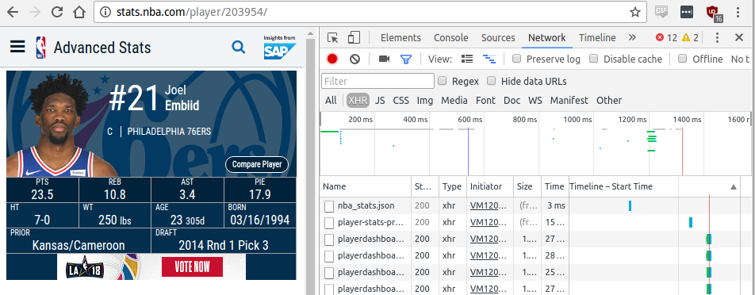
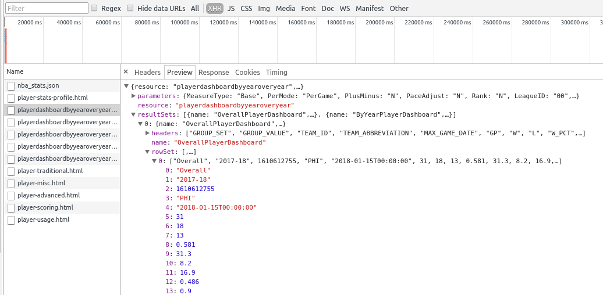
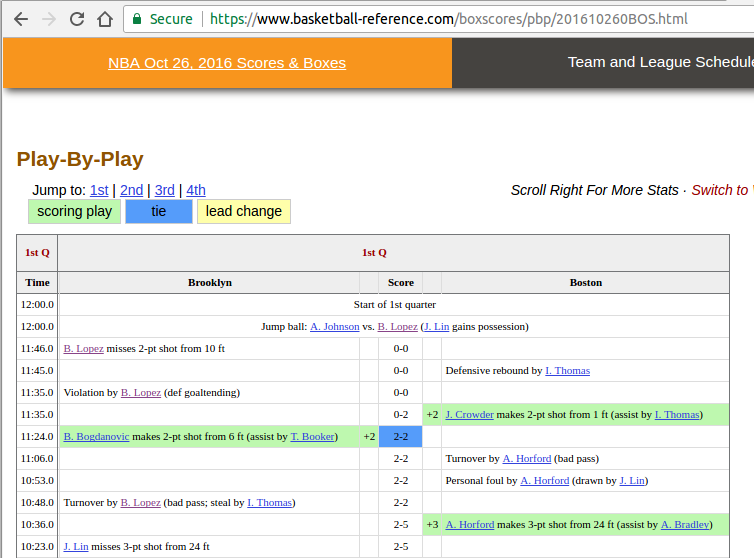
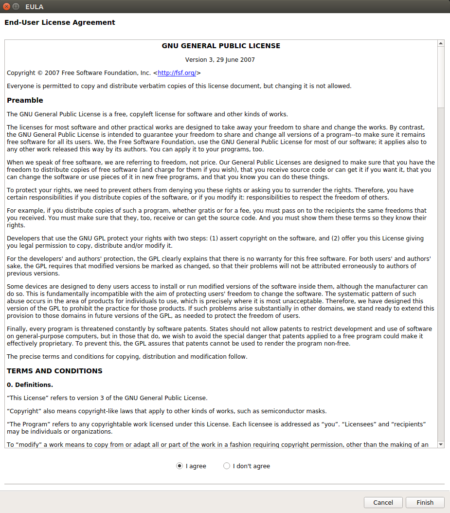
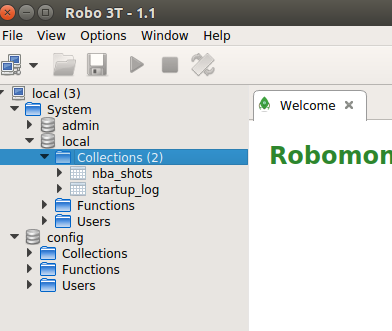
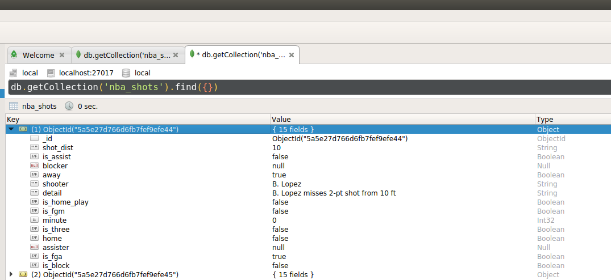

# Reproducability

When you are working with groups and when you are submitting code for review, making the project with setup ease is the one of the best practices in programming.

### Virtual Environments

In python, virtual environments have been introduced. They exist essentially as your projects own copy of python, where you can manage the packages that your project depends on and replicate on another computer for easy setup. To create a virtualenv, use these steps.

1. Create the virtual environment.
```
pip install virtualenv
virtualenv venv
```

2. Activate the virtualenv and install the predefined packages. This tutorial was made for linux, but you can find the Windows translation [here](https://github.com/sealneaward/template-py#windows-setup).
```
source venv/bin/activate
pip install -r requirements.txt
```

3. You can add packages to your virtualenv and update the requirements for your project as you proceed.
```
pip freeze > requirements.txt
```

### User Defined Python Packages

When you are writing a project in python, sometimes it is extremely useful to structure your project as an actual python package. To do this, there are standard procedures to include your scripts in a structured, pythonic packaged way.

1. Create a project and include the necessary resources for a python project. For python to recognize folders and scripts within your package, you should be including the `__init__.py` scripts in each folder. You can learn more about user defined python packages [here](https://www.learnpython.org/en/Modules_and_Packages) and additional usages of `__init__.py` to include more setup information.
```
└───project
│   └───package
│       └───data
|           |   utils.py
|           |   __init__.py
│       └───api
|           |   scrape.py
|           |   __init__.py
|       |   __init__.py
│   │   setup.py (package setup script)
```

2. You need to create a proper `setup.py` script that includes the package information.

```py
try:
    from setuptools import setup, find_packages
except ImportError:
    from distutils.core import setup

config = {
    'description': 'package description',
    'author': 'Neil Seward',
    'author_email': 'neil.seward@uoit.ca',
    'version': '0.0.1',
    'packages': find_packages(),
    'name': 'package_name'
}

setup(**config)
```

3. Once you have a good `setup.py` script, you can install your user defined packages.
```
python setup.py build
python setup.py install
```

4. In the `package` sub folder, try installing the reference package to your virtualenv.

# Scraping Tutorial

One of the first things that all data scientists need to learn is proper scraping and data collection techniques. In this breif tutorial, you will learn how to scrap data efficiently at a beginners level, read back end API's with little documentation, and storing data in a database.

### Using Developer Tools for Secret API's

Using the developer tools option on your browser (chrome or firefox), you can research the javascript calls to the website to see if there is any calls you can replicate in your code. By finding an API this way, you can eliminate the need to do any scraping.

#### Steps

1. Navigate to the [website](http://stats.nba.com/player/203954/) you wish to use as your external API. **Note: this does not work for all websites and you will see why in the next section on scraping.**

2. Open the developer tools on your browser. You should see a window similar to below.  


3. Select `Network > XHR`. You will see several json responses for different external API calls to the website. You can click one of the responses you want to inspect and you will see a window like below. You can explore the data in the Preview tab and find the exact URL in the Headers tab. You can see a raw json response with the [URL](http://stats.nba.com/stats/playerdashboardbyyearoveryear?DateFrom=&DateTo=&GameSegment=&LastNGames=0&LeagueID=00&Location=&MeasureType=Base&Month=0&OpponentTeamID=0&Outcome=&PORound=0&PaceAdjust=N&PerMode=PerGame&Period=0&PlayerID=203954&PlusMinus=N&Rank=N&Season=2017-18&SeasonSegment=&SeasonType=Regular+Season&ShotClockRange=&Split=yoy&VsConference=&VsDivision=) presented in the Headers tab.  


4. For the next step, we are going to be programming the calls in python. The jupyter notebook we use is `api.ipynb`.

### Scraping Websites Without Proper Backend API

Another key tool for data scientists is having the ability to scrape HTML and use regex for parsing purposes. In this section, you will be using beginner level regex parsing for constant data fields.

1. Find a [website](https://www.basketball-reference.com/boxscores/pbp/201610260BOS.html) that does not have a defined API that you can call the backend from.  


2. For the next step, we are going to be programming in python. The jupyter notebook we use is `scrape.ipynb`.

# Document Data Base Storage

For scraping and other tasks, sometimes it is easier and more effecient to store data on a database instance. If you are using large disctionary files that cannot be easily formatted into a single row format that is stored in a pandas dataframe and eventually in a csv file, you can use NoSQL databases for storage.

In this section, you can use a MongoDB instance to store information exactly how you see it as a dictionary.

1. Follow [these](https://docs.mongodb.com/manual/tutorial/install-mongodb-on-ubuntu/#install-mongodb-community-edition) steps to setup MongoDB on an Ubuntu instance.

2. You can use these commands to start, and restart mongodb on your computer.
```
sudo service mongod start
sudo service mongod stop
sudo service mongod restart
```

3. Download the RoboMongo management tool from [here](https://robomongo.org/download). Navigate to the downloads folder and use these instructions to install RoboMongo.
```
tar -xvzf {robomongo download file}
sudo mkdir /usr/local/bin/robomongo
sudo mv  {extracted robomongo download folder}/* /usr/local/bin/robomongo
cd /usr/local/bin/robomongo
sudo chmod +x {robomongo executable}
./{robomongo executable}
```

4. If you installed it correctly, you will first see this EULA agreement window.  


5. Once you have installed it properly, you can add a new collection. Right click the collections folder under the local instance and create a collection name.  


6. For the next steps, we are going to be programming in python. The jupyter notebook we are going to be using is `mongodb.ipynb`

7. Once finished, you can perform queries within robo mongo to see raw document data.  

